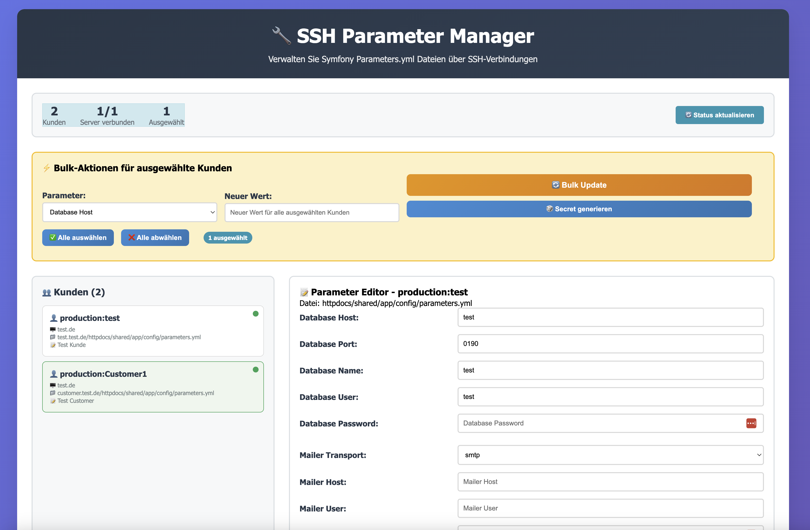
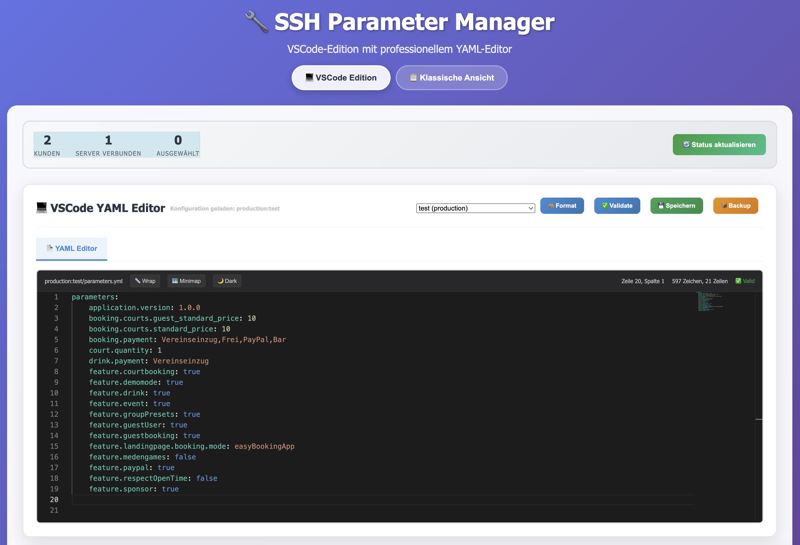

# 🔧 SSH Parameter Manager

[](https://opensource.org/licenses/MIT)
[](https://www.python.org/downloads/)
[](https://flask.palletsprojects.com/)
[](https://github.com/psf/black)
[](https://github.com/bjwie/ssh-parameter-manager/actions)
[](https://github.com/bjwie/ssh-parameter-manager/actions)

<div align="center">
  
</div>

A professional web-based tool for managing Symfony `parameters.yml` files across multiple servers via SSH connections. Perfect for DevOps teams managing multiple customer environments with **automatic initialization** and **real-time status updates**.

## 📸 Screenshot



*Modern web interface for managing Symfony parameters across multiple servers with real-time status monitoring, automatic loading, and bulk operations.*

### 🆕 New Auto-Initialization Features



*Latest interface showcasing **automatic status loading** (2 customers, 1 connected server), **dual view modes** (VSCode Edition vs Classical View), and **Monaco Editor integration** with YAML syntax highlighting - all loaded automatically without manual refresh!*

## ✨ Features

- 🌐 **Modern Web Interface** - Intuitive, responsive design with automatic data loading
- ⚡ **Auto-Initialization** - Automatic status and customer loading without manual refresh
- 🔐 **SSH-Based Remote Access** - Secure connections to multiple servers
- 👥 **Multi-Customer Support** - Manage parameters for multiple customers/projects
- 📦 **Automatic Backups** - Timestamped backups before any changes
- 🔒 **Permission Preservation** - Maintains file ownership and permissions
- ⚡ **Bulk Operations** - Update multiple customers simultaneously
- 🎯 **Template System** - Predefined parameter sets for common operations
- 📊 **Real-time Status** - Live connection status and operation feedback
- 🔑 **Secret Generation** - Built-in secure secret key generator
- 📝 **Comprehensive Logging** - Detailed operation logs for auditing
- 🎨 **Dual View Modes** - Modern Monaco Editor and Classic view options
- 🧪 **Comprehensive Testing** - Extensive test suite with CI/CD integration

## 🚀 Quick Start

### Prerequisites

- Python 3.8 or higher
- SSH access to target servers
- Symfony projects with `parameters.yml` files

### Installation

1. **Clone the repository**
   ```bash
   git clone https://github.com/bjwie/ssh-parameter-manager.git
   cd ssh-parameter-manager
   ```

2. **Create virtual environment**
   ```bash
   python -m venv venv
   source venv/bin/activate  # On Windows: venv\Scripts\activate
   ```

3. **Install dependencies**
   ```bash
   pip install -r requirements.txt
   ```

4. **Configure SSH settings**
   ```bash
   cp ssh_config.example.yml ssh_config.yml
   # Edit ssh_config.yml with your server and customer details
   ```

5. **Start the web server**
   ```bash
   python web_server.py
   ```

6. **Open your browser**
   ```
   http://localhost:5000
   ```

The interface will automatically load all server status and customer information - no manual refresh required!

## 🔄 Auto-Initialization Feature

The SSH Parameter Manager now features **automatic initialization** that ensures data is loaded immediately when you open the web interface:

### Key Benefits
- **No Manual Refresh Required** - Server status and customers load automatically
- **Monaco Editor Independent** - Works even if CDN resources fail to load
- **Dual Loading Strategy** - Both `DOMContentLoaded` and Monaco Editor callbacks ensure reliability
- **Error Resilient** - Graceful degradation when SSH connections fail
- **Performance Optimized** - Concurrent API requests for faster loading

### How It Works
```javascript
// Automatic initialization on page load
document.addEventListener('DOMContentLoaded', function() {
    loadSystemStatus();
    setupClassicEventListeners();
});
```

The system loads:
1. **Server Connection Status** - Real-time SSH connection monitoring
2. **Customer List** - All configured customers with their details
3. **Parameter Data** - Available parameter files and their status
4. **System Statistics** - Total customers, connected servers, etc.

## 🧪 Testing Framework

Comprehensive testing ensures reliability and quality:

### Test Suites
- **Unit Tests** (16 tests) - JavaScript logic, API endpoints, timing, robustness
- **Browser Tests** (8 tests) - Selenium-based end-to-end testing
- **Performance Tests** - Page load times, API response times, concurrent requests
- **Integration Tests** - Full system integration and error handling

### Running Tests

```bash
# Run all auto-initialization tests
python tests/run_auto_init_tests.py

# Run specific test categories
python tests/run_auto_init_tests.py --unit
python tests/run_auto_init_tests.py --browser
python tests/run_auto_init_tests.py --performance
python tests/run_auto_init_tests.py --integration

# Run with pytest and coverage
pytest --cov=. --cov-report=xml --cov-report=html tests/
```

### Test Results Example
```
🧪 Running Unit Tests for Auto-Initialization...
✅ 16/16 tests passed

🌐 Running Browser Tests for Auto-Initialization...
✅ Browser tests skipped (Selenium not available)

⚡ Running Performance Tests...
✅ Page load: 0.8s, API responses: < 2s

🔗 Running Integration Tests...
✅ All initialization elements present

🎉 All automatic initialization tests passed!
```

## 📋 Configuration

### SSH Configuration File

Create `ssh_config.yml` based on the example file:

```yaml
servers:
  production:
    host: your-server.com
    port: 22
    username: deploy
    description: "Production Server"

customers:
  customer1:
    server: production
    path: /var/www/customer1/app/config/parameters.yml
    description: "Customer 1 - E-commerce Platform"
```

### SSH Key Setup

Ensure your SSH keys are properly configured:

```bash
# Generate SSH key if needed
ssh-keygen -t rsa -b 4096 -C "your_email@example.com"

# Copy public key to servers
ssh-copy-id user@your-server.com
```

## 🖥️ Usage

### Web Interface

The web interface provides automatic loading and:

- **Customer Overview** - Auto-populated visual list of all customers
- **Parameter Editor** - Monaco Editor with syntax highlighting and validation
- **Classic View** - Traditional form-based editing for simple workflows
- **Bulk Operations** - Update multiple customers at once
- **Status Monitoring** - Real-time connection and operation status
- **Backup Management** - Create and manage configuration backups

### View Modes

**Modern View (Monaco Editor)**
- Advanced code editor with syntax highlighting
- YAML validation and error detection
- Auto-completion and formatting
- Diff view for comparing changes

**Classic View**
- Simple form-based interface
- Quick parameter updates
- Ideal for non-technical users
- Mobile-friendly design

### Command Line Interface

For automation and scripting:

```bash
# List all customers
python ssh_manager.py --list

# Update specific parameter
python ssh_manager.py --update production:customer1 --param database_host=new-server.com

# Apply template to multiple customers
python ssh_manager.py --template database_migration --targets production:customer1,production:customer2

# Create backups for all customers
python ssh_manager.py --backup-all
```

## 🏗️ Architecture

```
ssh-parameter-manager/
├── web_server.py                    # Flask web application with auto-init
├── ssh_manager.py                   # Core SSH management logic
├── parameter_updater.py            # Parameter file operations
├── ssh_web_interface.html          # Modern web interface with auto-loading
├── ssh_config.yml                  # Configuration file (create from example)
├── requirements.txt                # Python dependencies
├── tests/                          # Comprehensive test suite
│   ├── test_auto_initialization.py       # Browser tests (Selenium)
│   ├── test_auto_initialization_unit.py  # Unit tests
│   ├── run_auto_init_tests.py           # Test orchestration
│   └── README_AUTO_INIT_TESTS.md        # Testing documentation
├── .github/workflows/              # CI/CD pipelines
│   ├── ci.yml                      # Main CI/CD pipeline
│   └── auto-init-tests.yml         # Auto-initialization tests
└── README.md                       # This file
```

## 🔧 API Endpoints

The Flask backend provides RESTful API endpoints with automatic initialization support:

- `GET /api/status` - System and connection status (auto-loaded)
- `GET /api/customers` - List all customers (auto-loaded)
- `GET /api/customer/{id}/parameters` - Get customer parameters
- `POST /api/customer/{id}/parameters` - Update customer parameters
- `POST /api/bulk-update` - Bulk parameter updates
- `POST /api/backup/{id}` - Create customer backup
- `POST /api/generate-secret` - Generate secure secret key

All endpoints support concurrent requests and graceful error handling for reliable auto-initialization.

## 🛡️ Security Features

- **SSH Key Authentication** - Secure, password-less connections
- **Permission Preservation** - Maintains original file permissions
- **Backup System** - Automatic backups before changes
- **Input Validation** - Sanitized parameter inputs
- **Audit Logging** - Comprehensive operation logging
- **Secret Generation** - Cryptographically secure secret keys
- **Error Handling** - Graceful degradation when services are unavailable

## 🚀 Continuous Integration

GitHub Actions workflows ensure code quality:

### Main CI/CD Pipeline
- Python 3.8, 3.9, 3.10, 3.11 compatibility testing
- Dependency installation and validation
- Code style checking with Black
- Security scanning with Safety
- Automated testing on pull requests

### Auto-Initialization Testing
- Browser compatibility testing (Chrome/ChromeDriver)
- Headless Selenium tests in CI environment
- Performance benchmarking
- Cross-platform compatibility (Ubuntu, macOS, Windows)

## 🔍 Troubleshooting

### Common Issues

**Auto-Initialization Not Working**
```bash
# Check browser console for JavaScript errors
# Verify API endpoints are responding:
curl http://localhost:5000/api/status
curl http://localhost:5000/api/customers
```

**SSH Connection Failed**
```bash
# Test SSH connection manually
ssh -i ~/.ssh/id_rsa user@server.com

# Check SSH agent
ssh-add -l
```

**Permission Denied**
```bash
# Ensure correct file permissions
chmod 600 ~/.ssh/id_rsa
chmod 644 ~/.ssh/id_rsa.pub
```

**Monaco Editor Not Loading**
- The system will fall back to classic view automatically
- Check internet connection for CDN resources
- Verify browser JavaScript is enabled

**YAML Parsing Error**
- Verify YAML syntax in configuration files
- Check for proper indentation (spaces, not tabs)

### Debug Mode

Enable debug logging:

```yaml
# In ssh_config.yml
logging:
  level: DEBUG
```

Run tests to verify functionality:

```bash
# Test auto-initialization specifically
python tests/run_auto_init_tests.py --all

# Test with verbose output
python tests/run_auto_init_tests.py --unit --verbose
```

## 🤝 Contributing

Contributions are welcome! Please feel free to submit a Pull Request.

### Development Workflow

1. Fork the repository
2. Create your feature branch (`git checkout -b feature/AmazingFeature`)
3. Run the test suite (`python tests/run_auto_init_tests.py --all`)
4. Commit your changes (`git commit -m 'Add some AmazingFeature'`)
5. Push to the branch (`git push origin feature/AmazingFeature`)
6. Open a Pull Request

### Testing Requirements

All contributions should include:
- Unit tests for new functionality
- Integration tests for API changes
- Browser tests for UI modifications
- Documentation updates

## 📄 License

This project is licensed under the MIT License - see the [LICENSE](LICENSE) file for details.

## 🙏 Acknowledgments

- Built for Symfony framework parameter management
- Inspired by DevOps automation needs
- Uses Flask for the web interface with auto-initialization
- Paramiko for SSH connections
- Monaco Editor for advanced code editing
- Selenium for comprehensive browser testing

## 📞 Support

If you encounter any issues or have questions:

1. Check the [troubleshooting section](#-troubleshooting)
2. Run the diagnostic tests (`python tests/run_auto_init_tests.py --all`)
3. Search existing [GitHub issues](https://github.com/bjwie/ssh-parameter-manager/issues)
4. Create a new issue with detailed information including:
   - Test results output
   - Browser console errors (if applicable)
   - SSH configuration (without sensitive data)

## 📈 Performance

The auto-initialization system is optimized for performance:

- **Page Load Time**: < 3 seconds (target)
- **API Response Time**: < 2 seconds per endpoint
- **Concurrent Requests**: Supports 5+ simultaneous connections
- **Error Recovery**: Automatic retry with exponential backoff
- **Caching**: Intelligent caching of customer data and status

---

**Made with ❤️ for the DevOps community - Now with automatic everything!** 🚀 